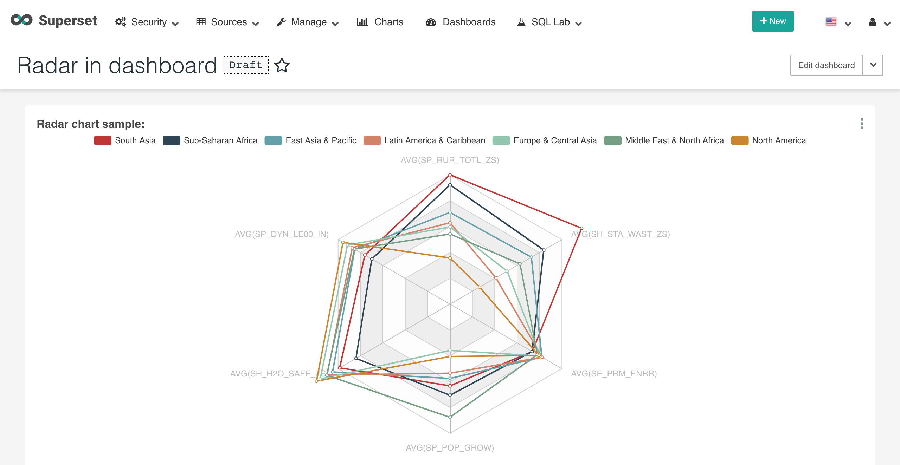

# superset-ui-preset-chart-echarts-basic 🔌💡

WIP.

The initial purpose of this repo is to support [Echarts](https://echarts.apache.org) radar in [Superset](https://superset.incubator.apache.org/). You can also use it as a reference on how to support other visualizations of Echarts.

## Available chart

### Echarts Radar Chart

Snapshot in Superset:



See also:

* [Plugin Package Readme](/packages/supsuperset-ui-preset-chart-echarts-basic)
* [Echarts Radar Official Gallery](https://echarts.apache.org/examples/en/index.html#chart-type-radar)

## Demo (Storybook)

Current master: http://echarts-basic.iamhd.top

> Note: You have to customize your own netlify to use this.

## Packages

| Package | Version | Note |
|--|--|--|
| [superset-ui-preset-chart-echarts-basic](https://github.com/huandzh/superset-ui-plugins-echarts-basic/tree/master/packages/superset-ui-preset-chart-echarts-basic) | [](https://img.shields.io/npm/v/superset-ui-preset-chart-echarts-basic.svg?style=flat-square) | [README](/packages/supsuperset-ui-preset-chart-echarts-basic)|

> See README to use

## Contribution and development guide

Please read the [contributing guidelines](https://github.com/apache-superset/superset-ui/blob/master/CONTRIBUTING.md) which include development environment setup
and other things you should know about coding in this repo.

> Note: This repo is created with template at https://github.com/apache-superset/superset-ui-plugins-template .

### Tips on developing new plugin

The following is a typical plugin class:

```typescript
export default class EchartsBasicRadarPlugin extends ChartPlugin {
  constructor() {
    super({
      controlPanel,
      loadChart: () => import('../EchartsBase'),
      metadata,
      transformProps,
    });
  }
}
```

Let's break it down:

* metadata - define the name and thumbnail displayed when selecting a chart to create in Superset
* controlPanel - define control panel shown on left side where user create a new chart in Superset, and thus customize query and display settings for the chart
* loadChart - load react componet of the chart
* transformProps - transform form data from control panel and query data into chart props which also includes data in supported format


### License

Apache-2.0
